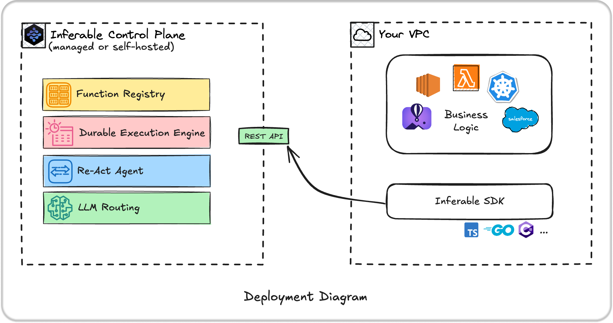

<div align="center">

[](https://inferable.ai) [](https://docs.inferable.ai/)

  

</div>

# About Inferable

Inferable is an open source platform that helps you build reliable LLM-powered agentic automations at scale.

## Key Features

- Managed Agent Runtime - ReAct-like agent runtime powered by your own functions
- Durable Tool Calling - Recover from failures, load balance tool calls across compute, cache results
- Zero Network Config - No inbound connections or networking required for distributed tools
- Multiple Language Support - Native SDKs for TypeScript, Go, .NET and more coming up
- Fully Open Source - MIT licensed and self-hostable



## Quick Start

The easiest way to get started is by following the [Quickstart](https://docs.inferable.ai/pages/quick-start).

## How does it work?

Inferable provides an agent runtime that manages agent state, tool calling, routing the tool calls to your functions, and providing you with structured results. To put it simply:

> You bring the functions + we bring the agent runtime = Custom autonomous agent

**1. Define one or more functions that can be called by an automation**

```typescript
// a plain old function in your codebase
async function readWebPage({ url }: { url: string }) {
  const browser = await chromium.launch();
  const page = await browser.newPage();
  await page.goto(url);
  return page.content();
}
```

**2. Register the function with Inferable**

```typescript
import Inferable from "inferable";

const client = new Inferable({ apiSecret: "..." });

client.default.register({
  name: "readWebPage",
  description: "Reads a web page and gets the content"
  func: readWebPage,
  input: z.object({
    url: z.string(),
  }),
});
```

At this point, you have an autonomous agent.

**3. Trigger run!**

You can trigger this agent via our [playground](https://app.inferable.ai), [Slack](https://docs.inferable.ai/pages/slack), your custom code and more.

Here's an example of triggering it via code:

```typescript
inferable.run({
  initialPrompt: `
    Produce me a list of all the open source projects
    at https://news.ycombinator.com/show, with their
    github url, programming language and fork count.
  `,
  resultSchema: z.array(
    z.object({
      url: z.string().regex(/^https:\/\/github\.com\/.*$/),
      language: z.string(),
      forkCount: z.number(),
    })
  ),
  // attachedFunctions: ["readWebPage"], // Optional, defaults to all registered functions
});
```

## What can I build with this?

Inferable is best for building agents that are multi-step, distributed (tools/functions across multiple computers).

Here are a few demos:

- **[Text to SQL Agent](https://github.com/inferablehq/inferable/blob/main/demos/typescript/sql-to-text/service.ts)**: Let Inferable access a database (read-only or read/write), and ask it to perform actions.
- **[Terminal Copilot](https://github.com/inferablehq/inferable/blob/main/demos/typescript/terminal-copilot/service.ts)**: Run commands in your terminal, with explicit human approvals.
- **[Data Connector](https://www.inferable.ai/use-cases/data-connector)**: Deploy a docker container in your infrastructure, and let Inferable take actions with your REST / GraphQL APIs.


## Self Hosting

Inferable is 100% open-source and self-hostable. See our [self hosting guide](https://docs.inferable.ai/pages/self-hosting) for more details.

## Language Support

- [Node.js / TypeScript](./sdk-node/README.md) ([Quick start](./sdk-node/README.md#quick-start))
- [Go](./sdk-go/README.md) ([Quick start](./sdk-go/README.md#quick-start))
- [.NET](./sdk-dotnet/README.md) ([Quick start](./sdk-dotnet/README.md#quick-start))
- [React](./sdk-react/README.md) ([Quick start](./sdk-react/README.md#quick-start))

## Open Source

This repository contains the Inferable control-plane, as well as SDKs for various languages.

**Core services:**

- `/control-plane` - The core Inferable control plane service
- `/app` - Playground front-end and management console
- `/cli` - Command-line interface tool (alpha)

**SDKs:**

- `/sdk-node` - Node.js/TypeScript SDK
- `/sdk-go` - Go SDK
- `/sdk-dotnet` - .NET SDK
- `/sdk-react` - React SDK

**Bootstrap templates:**

- `/bootstrap-node` - Node.js bootstrap application template
- `/bootstrap-go` - Go bootstrap application template
- `/bootstrap-dotnet` - .NET bootstrap application template

## Contributing

We welcome contributions to all projects in the Inferable repository. Please read our [contributing guidelines](./CONTRIBUTING.md) before submitting any pull requests.

## License

All code in this repository is licensed under the MIT License.
