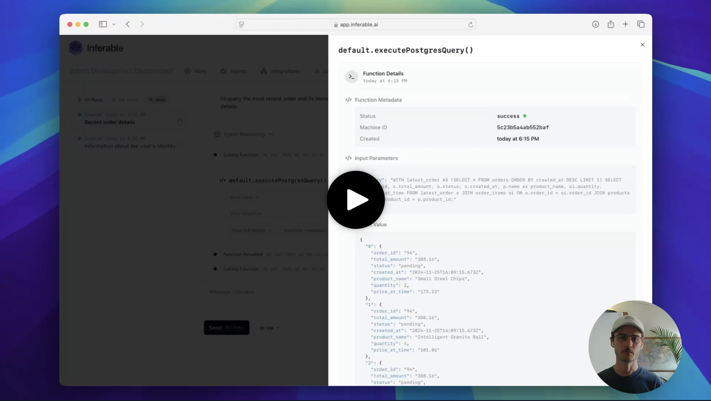
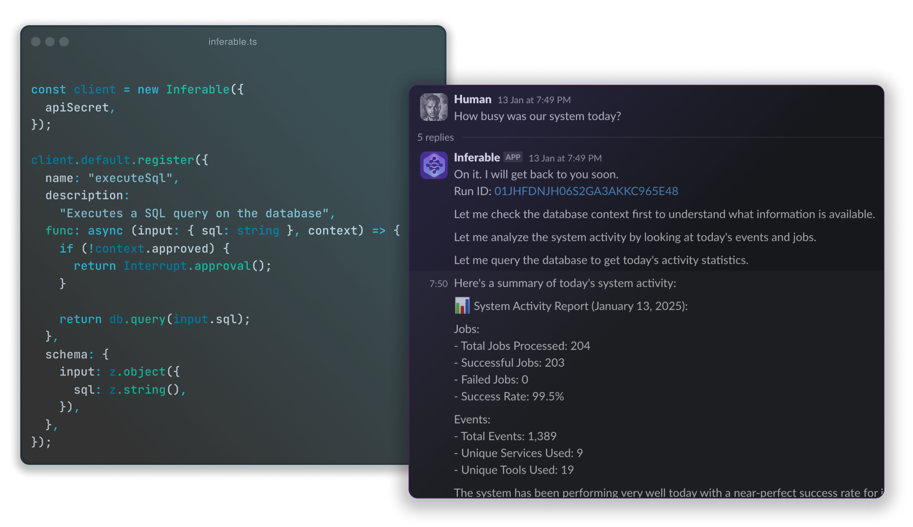

# Inferable

Inferable is the easiest way to convert your existing internal APIs, functions, and scripts into   autonomous agents that you can have a conversation with.

  

## ✨ Features

### Agent Runtime
- Open Source, MIT licensed and [self-hostable](https://docs.inferable.ai/pages/self-hosting)
- Fully managed Re-Act (reasoning + acting) [agent control-plane](https://docs.inferable.ai/pages/control-plane)
- Composable agents with [structured outputs](https://docs.inferable.ai/pages/structured-output) support
- Trigger agents from [Slack](https://docs.inferable.ai/pages/slack), [E-mail](https://docs.inferable.ai/pages/email) and more

### Distributed tool calling with fault-tolerance
- [Durable tool calls](https://docs.inferable.ai/pages/resilient-functions) with fault-tolerance, load balancing, and caching
- Built-in [tool discovery](https://docs.inferable.ai/pages/functions) across your internal infrastructure
- [Dynamic tool attachment](https://docs.inferable.ai/pages/runs#function-selection) based on conversational context

### Security & Human oversight
- Primitives for BYO [custom Authentication and Authorization](https://docs.inferable.ai/pages/custom-auth)
- [Human-in-the-loop](https://docs.inferable.ai/pages/human-in-the-loop) with explicit approvals driven by code
- [No inbound connections](https://docs.inferable.ai/pages/enterprise#private-networking) or ingress required with long-polling SDKs

### Integrations & SDKs
- Native SDKs for [TypeScript](./sdk-node/README.md), [Go](./sdk-go/README.md), [.NET](./sdk-dotnet/README.md) and more coming up
- Trigger agents from [Zapier](https://docs.inferable.ai/pages/zapier), [HTTP APIs](https://docs.inferable.ai/pages/api/create-run) for advanced integrations
- [Adapters](./adapters/) to convert Postgres, GraphQL, tRPC into tools

## ⚡️ Quick Start

The easiest way to get started is by following the [Quickstart](https://docs.inferable.ai/pages/quick-start).

## 🔗 Demos

- **[Text to SQL Agent](https://github.com/inferablehq/inferable/blob/main/demos/typescript/sql-to-text/service.ts)**: Let Inferable access a database (read-only or read/write), and ask it to perform actions.
- **[Terminal Copilot](https://github.com/inferablehq/inferable/blob/main/demos/typescript/terminal-copilot/service.ts)**: Run commands in your terminal, with explicit human approvals.
- **[Data Connector](https://www.inferable.ai/use-cases/data-connector)**: Deploy a docker container in your infrastructure, and let Inferable take actions with your REST / GraphQL APIs.

## 📚 Language Support

| Language | Source | Package |
| -------- | -------- | -------- |
| Node.js / TypeScript | [Quick start](./sdk-node/README.md) | [NPM](https://www.npmjs.com/package/inferable) |
| Go | [Quick start](./sdk-go/README.md) | [Go](https://pkg.go.dev/github.com/inferablehq/inferable/sdk-go) |
| .NET | [Quick start](./sdk-dotnet/README.md) | [NuGet](https://www.nuget.org/packages/Inferable) |
| React (Chat-only) | [Quick start](./sdk-react/README.md) | [NPM](https://www.npmjs.com/package/@inferable/react) |
| Bash | [Quick start](./sdk-bash/README.md) | [Source](https://github.com/inferablehq/inferable/blob/main/sdk-bash/inferable.sh) |

## 🚀 Open Source

This repository contains the Inferable control-plane, as well as SDKs for various languages.

**Core services:**

- `/control-plane` - The core Inferable control plane service
- `/app` - Playground front-end and management console
- `/cli` - Command-line interface tool (alpha)

**SDKs:**

- `/sdk-node` - Node.js/TypeScript SDK
- `/sdk-go` - Go SDK
- `/sdk-dotnet` - .NET SDK
- `/sdk-react` - React SDK

**Bootstrap templates:**

- `/bootstrap-node` - Node.js bootstrap application template
- `/bootstrap-go` - Go bootstrap application template
- `/bootstrap-dotnet` - .NET bootstrap application template

## 💾 Self Hosting

Inferable is 100% open-source and self-hostable. See our [self hosting guide](https://docs.inferable.ai/pages/self-hosting) for more details.

## 🤝 Contributing

We welcome contributions to all projects in the Inferable repository. Please read our [contributing guidelines](./CONTRIBUTING.md) before submitting any pull requests.

## 📝 License

All code in this repository is licensed under the MIT License.
