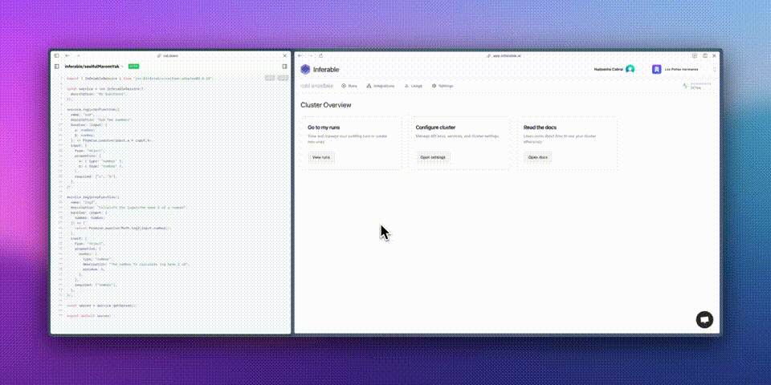

<p align="center">
  
</p>

# Val Town Adapter

[](https://opensource.org/licenses/MIT)
[](https://docs.inferable.ai/)

This is the official Inferable AI adapter for Val Town. It allows you to expose your Val Town functions as tools for Inferable cluster. Inferable is an [open-source developer platform for building AI agents](https://www.inferable.ai) and [Vals are small JavaScript or TypeScript snippets of code](https://www.val.town/), written in the browser and runs on a managed val.town server.

[](https://a.inferable.ai/valtown.mp4)

## Quick Start

```typescript
import { InferableService } from "jsr:@inferable/valtown-adapter";

const service = new InferableService({
  description: "My functions",
  token: "sk-inf-val-xxxx", // Optional: Add a token to secure your endpoint.
});

service.registerFunction({
  name: "sum",
  description: "Sum two numbers",
  handler: (input: { a: number; b: number }) => Promise.resolve(input.a + input.b),
  input: {
    type: "object",
    properties: {
      a: { type: "number" },
      b: { type: "number" },
    },
    required: ["a", "b"],
  },
});

const server = service.getServer();

export default server;
```

And then you can install this val in your cluster via Cluster > Integrations > Val.town.

## API Reference

### `InferableService`

The main class for creating an Inferable service that exposes Val Town functions.

#### Constructor Options

```typescript
new InferableService({
  description: string;  // A description of your service
  token?: string;      // Optional: A token to authenticate requests
})
```

#### Methods

##### `registerFunction(options)`

Register a function to be exposed through the Inferable service.

Parameters:
- `options`: Object with the following properties:
  - `name`: string - The name of the function
  - `description`: string - A description of what the function does
  - `handler`: (input: any) => Promise<any> - The function implementation
  - `input`: Object - JSON Schema describing the input parameters
    - `type`: "object" (literal)
    - `properties`: Record of parameter names to their types
    - `required`: string[] - List of required parameter names

##### `getServer()`

Returns a request handler function compatible with Val Town's serverless environment.

Returns: `(request: Request) => Promise<Response>`

## Endpoints

The adapter exposes two main endpoints:

### GET /meta

Returns metadata about the service, including:
- Service description
- List of available functions and their schemas

### POST /exec/functions/:functionName

Executes a registered function.
- Request body should match the function's input schema
- Returns the function result in the response

## Security

To secure your endpoint, you can provide a token in the constructor:

```typescript
const service = new InferableService({
  description: "My secure functions",
  token: "sk-inf-val-xxxx",
});
```

When a token is set, all requests must include a Bearer token in the Authorization header:
```
Authorization: Bearer sk-inf-val-xxxx
```

To get a token, install the Val.town integration in your cluster. Upon providing the URL for the val, you'll be provided with a token.

## Documentation

- [Inferable documentation](https://docs.inferable.ai/) contains all the information you need to get started with Inferable.
- [Val Town documentation](https://www.val.town/docs) for more information about Val Town.

## Support

For support or questions, please [create an issue in the repository](https://github.com/inferablehq/inferable/issues).

## Contributing

Contributions to the Inferable Val Town Adapter are welcome. Please ensure that your code adheres to the existing style and includes appropriate tests.

## License

This project is licensed under the MIT License.
