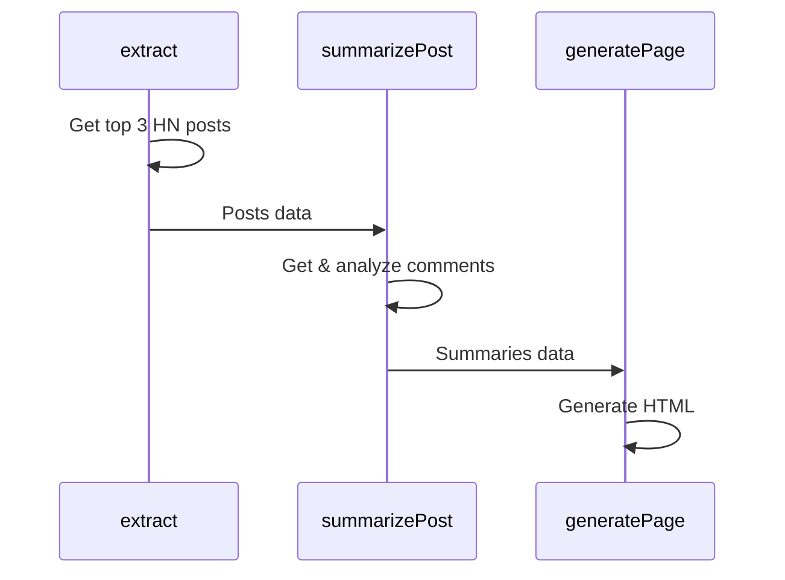

<p align="center">
  
</p>

# Inferable .NET Bootstrap

This is a .NET bootstrap application that demonstrates how to integrate and use our SDK. It serves as a reference implementation and starting point for .NET developers.

## The Application

The application is a simple .NET application that extracts the top posts from Hacker News and summarizes the comments for each post. It demonstrates how to:

- Register C# functions with Inferable
- Trigger a Run programmatically to orchestrate the functions
- Control the control flow of the Run using native C# async/await primitives



## How to Run

1. Start the local worker machine:

```bash
dotnet run
```

2. Trigger the HN extraction:

```bash
dotnet run run
```

## How it works

1. The worker machine uses the Inferable .NET SDK to register functions with Inferable. These functions are registered in the `Register.cs` file:

- `GetUrlContent`: Fetches the content of a URL and strips HTML tags
- `ScoreHNPost`: Scores a Hacker News post based on upvotes and comment count
- `GeneratePage`: Generates an HTML page from markdown

2. The `Run.cs` script defines three main operations that are orchestrated by Inferable:

- `extract`: Extracts and scores the top 10 HN posts, selecting the top 3
- `summarizePost`: Summarizes the comments for each selected post
- `generatePage`: Generates an HTML page containing the summaries

3. The application flow:

- The extract operation fetches the top posts from Hacker News and scores them using internal scoring logic
- For each selected post, a separate summarization run analyzes the comments
- Finally, the generate operation creates an HTML page containing all the summaries

4. The application uses C# primitives for control flow:

- Async/await for non-blocking operations
- Strong typing with C# records and classes
- Reflection for inferring the function signatures and result schema
