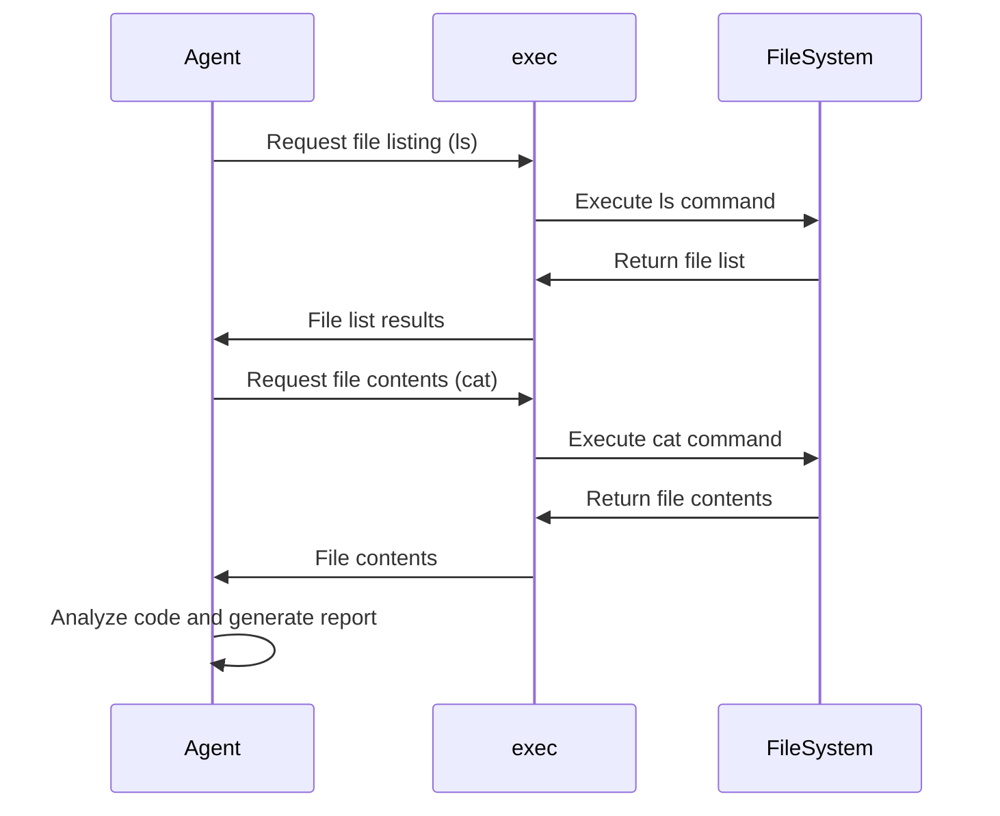

<p align="center">
  
</p>

# Inferable Go Bootstrap

This is a Go bootstrap application that demonstrates how to integrate and use our SDK. It serves as a reference implementation and starting point for Go developers.

## Docs

To follow along with the docs, go to our [quickstart](https://docs.inferable.ai/quick-start).

## What does this application do?

The application demonstrates an agent that can inspect and analyze source code by iteratively executing system commands. It shows how to:

1. Register Go functions with Inferable ([main.go](./main.go))
2. Trigger a Run programmatically to provide a goal ([cmd/trigger.go](./cmd/trigger.go))



## How to Run

1. Start the local worker machine

```bash
go run main.go
```

2. Trigger the Run

```bash
go run cmd/trigger.go
```

## How it works

1. The worker machine uses the Inferable Go SDK to register the `exec` function with Inferable. This function:

   - Accepts `ls` or `cat` commands with path arguments
   - Only allows accessing paths that start with "./"
   - Returns the stdout and stderr from the command execution

2. The `trigger.go` script creates a Re-Act agent that:

   - Receives an initial prompt to inspect source code in the current directory
   - Can iteratively call the `exec` function to list and read files
   - Produces a final report containing:
     - The name of the program
     - A list of its capabilities

3. The agent will:

   - Use `ls` to discover files in the directory
   - Use `cat` to read the contents of relevant files
   - Analyze the code to understand its functionality
   - Generate a structured report based on its findings

## Security

- The `exec` function is restricted to only allow `ls` and `cat` commands
- File access is restricted to paths starting with "./"
- The constraints are enforced by source code, and cannot be bypassed by the agent
