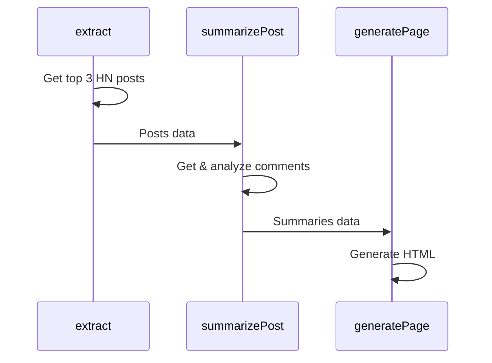

# Inferable Go Bootstrap

This is a Go bootstrap application that demonstrates how to integrate and use our SDK. It serves as a reference implementation and starting point for Go developers.

## The Application

The application is a simple Go application that extracts the top posts from Hacker News and summarizes the comments for each post. It demonstrates how to:

- Register Go functions with Inferable
- Trigger a Run programmatically to orchestrate the functions
- Control the control flow of the Run using native Go control flow primitives



## How to Run

1. Start the local worker machine

```bash
go run main.go
```

2. Trigger the Run

```bash
go run cmd/run.go
```

## How it works

1. The worker machine uses the Inferable Go SDK to register the functions with Inferable. These functions are:

- `GetUrlContent`: Get the html content of any url
- `ScoreHNPost`: Score a post based on the number of comments and upvotes
- `GeneratePage`: Generate an HTML page with the summaries and save it to a tmp file in your OS's temp directory

2. The `run.go` script defines "Runs" with the Inferable Go SDK. These are:

- `extractRun`: Extracts the top 3 HN posts
- `summarizeRun`: Summarizes the comments for a given post
- `generateRun`: Generates an HTML page from the summaries

3. Given the run configuration (prompts, result schema, etc), the worker machine will orchestrate the functions to generate the page.

- `extractRun` will get the top 3 HN posts using the `GetUrlContent` function, and score them using the `ScoreHNPost` function
- `summarizeRun` will summarize the comments for each post using the `GetUrlContent` function
- `generateRun` will generate the HTML page using the `GeneratePage` function
