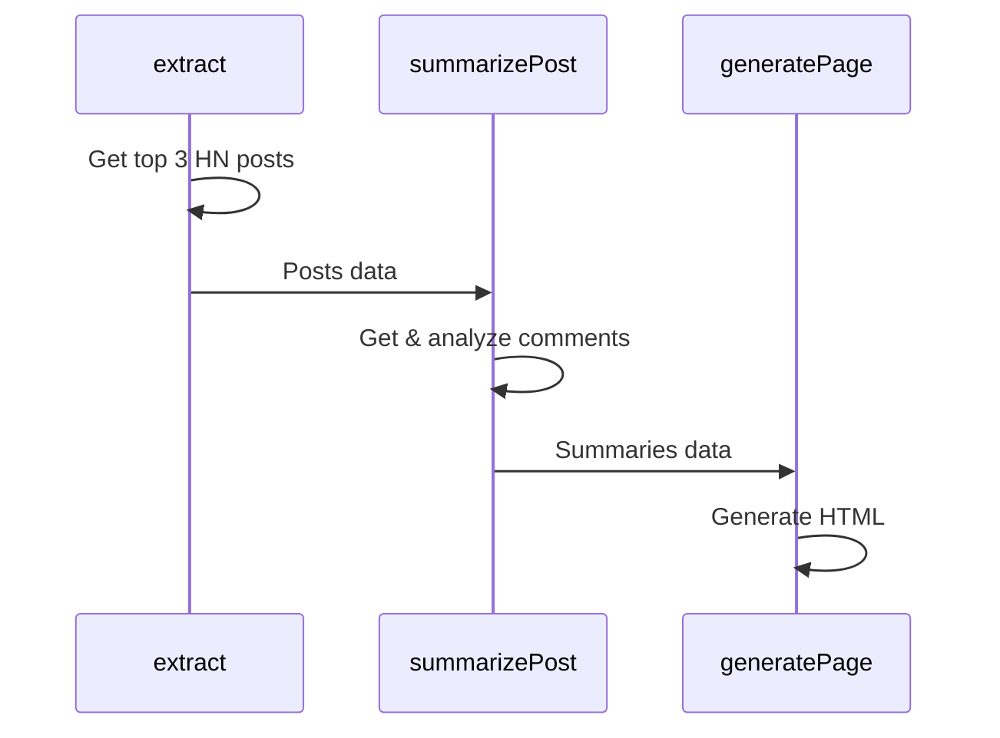

# Inferable Node.js Bootstrap

This is a Node.js bootstrap application that demonstrates how to integrate and use our SDK. It serves as a reference implementation and starting point for Node.js developers.

## The Application

The application is a simple Node.js application that extracts the top posts from Hacker News and summarizes the comments for each post. It demonstrates how to:

- Register Typescript functions with Inferable
- Trigger a Run programmatically to orchestrate the functions
- Control the control flow of the Run using native Node.js control flow primitives



## How to Run

1. Start the local worker machine

```bash
npm run dev
```

2. Trigger the Run

```bash
npm run run
```

## How it works

1. The worker machine uses the Inferable Node.js SDK to register the functions with Inferable. These functions are:

- `getUrlContent`: Get the html content of any url
- `scoreHNPost`: Score a post based on the number of comments and upvotes
- `generatePage`: Generate an HTML page with the summaries and save it to a tmp file in your OS's temp directory

2. The `run.ts` script defines "Runs" with the Inferable Node.js SDK. These are:

- `extract`: Extracts the top 3 HN posts
- `summarizePost`: Summarizes the comments for a given post
- `generatePage`: Generates an HTML page from the summaries

3. Given the run configuration (prompts, result schema, etc), the worker machine will orchestrate the functions to generate the page.

- `extract` will get the top 3 HN posts using the `getUrlContent` function, and score them using the `scoreHNPost` function
- `summarizePost` will summarize the comments for each post using the `getUrlContent` function
- `generatePage` will generate the HTML page using the `generatePage` function
