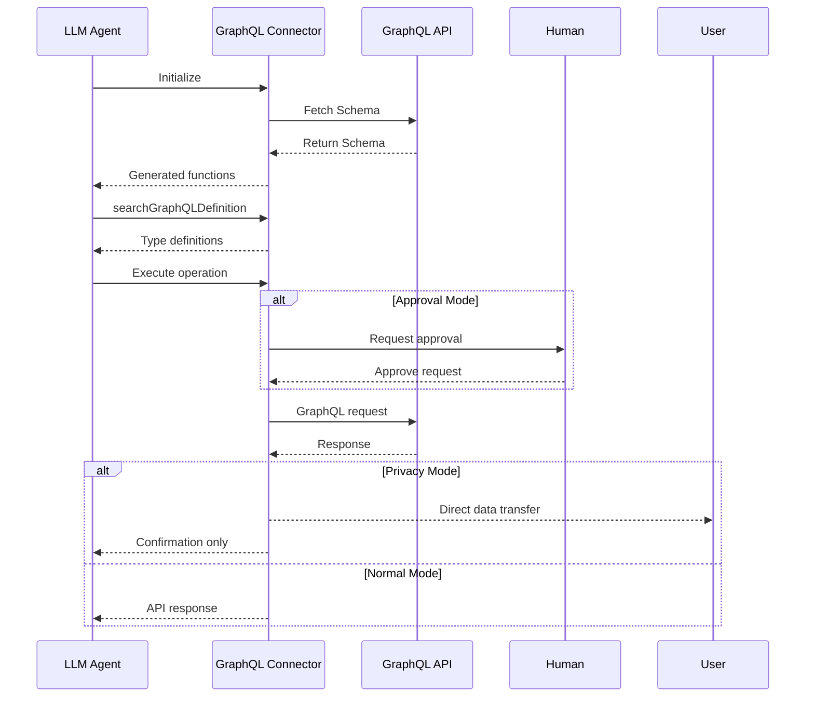

# GraphQL Data Connector

> 📝 The GraphQL Data Connector is experimental and still under development.
> If you encounter any issues, please [open an issue](https://github.com/inferablehq/inferable/issues/).

The GraphQL Data Connector enables LLMs to interact with GraphQL APIs through Inferable by automatically generating functions from GraphQL schemas and providing schema introspection capabilities.

## Configuration

Configure the connector in your `config.json`:

```json
{
  "type": "graphql",
  "name": "myGraphql",
  "schemaUrl": "process.env.GRAPHQL_SCHEMA_URL",
  "endpoint": "process.env.GRAPHQL_ENDPOINT",
  "defaultHeaders": {
    "Authorization": "process.env.GRAPHQL_AUTH_HEADER"
  }
}
```

## How It Works

The connector operates in three main phases:

1. **Schema Discovery**: When initialized, it fetches and parses the GraphQL schema to generate callable functions
2. **Type Introspection**: Provides detailed type information to help construct valid queries
3. **Query Execution**: Executes GraphQL operations while respecting privacy and security settings



## Features

- **Schema Introspection**: Provides detailed type information for constructing queries
- **Automatic Function Generation**: Creates Inferable functions from GraphQL operations
- **Privacy Mode**: Prevents sensitive API responses from passing through the LLM
- **Approval Mode**: Requires human approval for API requests
- **Type Validation**: Ensures queries match the GraphQL schema

## Important Considerations

### Schema Introspection

The connector provides a special `searchGraphQLDefinition` function to explore types:

```typescript
// Example introspection request
{
  operation: "query",
  fieldName: "user"
}

// Example response
{
  operation: "query",
  fieldName: "user",
  inputTypes: {
    id: {
      type: "ID!",
      definition: { type: "scalar", name: "ID" }
    }
  },
  outputType: {
    type: "User!",
    definition: {
      type: "object",
      fields: {
        id: { type: "ID!" },
        name: { type: "String!" },
        email: { type: "String" }
      }
    }
  }
}
```

### Query Construction

Use the type information to construct valid queries:

```graphql
query user($id: ID!) {
  user(id: $id) {
    id
    name
    email
  }
}
```

### Security Considerations

- **Authentication**: Configure through defaultHeaders
- **Privacy Mode**: Prevents sensitive API responses from reaching the LLM
- **Approval Mode**: Requires approval before making requests
- **Schema Validation**: Ensures queries match the GraphQL schema

### GraphQL-Specific Features

- **Type System**: Full support for GraphQL's type system
- **Operation Types**: Supports both queries and mutations
- **Field Selection**: Allows precise selection of required fields
- **Variables**: Supports GraphQL variables for dynamic queries
- **Nested Types**: Handles complex nested object types
- **Schema Exploration**: Built-in type introspection capabilities
