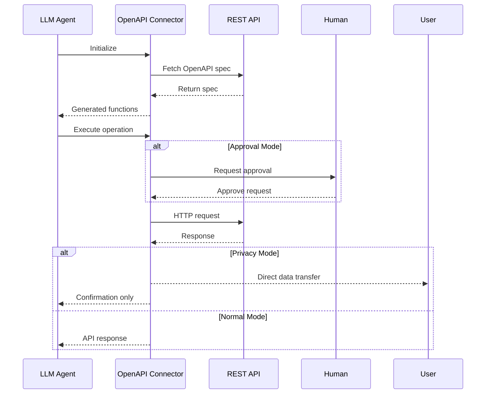

# OpenAPI Data Connector

> 📝 The OpenAPI Data Connector is experimental and still under development.
> You may run into issues with large OpenAPI schemas and function selection performance.
> We are working on this currently, in the mean time we recommend [limiting the operations](#large-schemas) as nescessary.
> If you encounter any issues, please [open an issue](https://github.com/inferablehq/inferable/issues/).

The OpenAPI Data Connector enables LLMs to interact with REST APIs through Inferable by automatically generating functions from OpenAPI/Swagger specifications.

## Request Configuration

Configure the connector in your `config.json`:

```json
{
  "type": "open-api",
  "name": "myOpenApi",
  "specUrl": "process.env.OPENAPI_SPEC_URL",
  "endpoint": "process.env.SERVER_URL",
  "defaultHeaders": {
    "Authorization": "process.env.SERVER_AUTH_HEADER"
  },
}
```

## How It Works

The connector operates in two main phases:

1. **Spec Discovery**: When initialized, it fetches and parses the OpenAPI specification to generate callable functions
2. **Request Execution**: Executes HTTP requests based on the spec definitions while respecting privacy and security settings



## Features

- **Automatic Function Generation**: Creates Inferable functions from OpenAPI operations
- **Privacy Mode**: Prevents sensitive API responses from passing through the LLM
- **Approval Mode**: Requires human approval for API requests
- **Parameter Validation**: Ensures requests match the OpenAPI specification
- **Default Headers**: Supports global headers for authentication
- **OperationId Filtering**: Explicitly allow certain OpenAPI operations

## Important Considerations

### Operation Structure

The connector automatically generates functions from OpenAPI operations:

```typescript
// Example operation structure
{
  name: "getUserProfile",
  description: "GET /users/{id}. Ask the user to provide values for any required parameters.",
  schema: {
    input: {
      path: "/users/{id}",
      method: "GET",
      parameters: {
        id: "string"
      }
    }
  }
}
```

### Large Schemas

By default, the connector will attach **all** operations in the OpenAPI spec to the model. If your schema is large, consider using `config.connectors[].allowedOperations` to explicitly allow only the operations you need.

### Security Considerations

- **Authentication**: Configure through defaultHeaders
- **Privacy Mode**: Prevents sensitive API responses from reaching the LLM
- **Approval Mode**: Requires approval before making requests
- **URL Validation**: Ensures requests match the OpenAPI spec paths

### OpenAPI-Specific Features

- **Automatic Discovery**: Loads and parses OpenAPI/Swagger specs
- **Operation Mapping**: Converts API endpoints to callable functions
- **Parameter Handling**: Supports path, query, and body parameters
- **Content Types**: Handles JSON request/response bodies
- **Server URLs**: Uses spec-defined servers or custom endpoints
