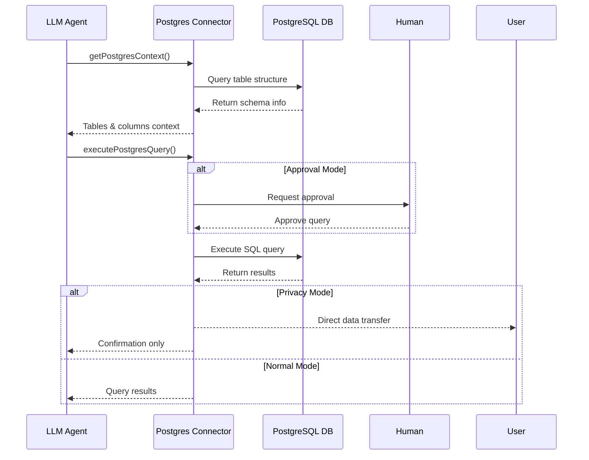

# Postgres Data Connector

The Postgres Data Connector enables LLMs to interact with PostgreSQL databases through Inferable by providing schema understanding and query execution capabilities.

## Configuration

Configure the connector in your `config.json`:

```json
{
  "type": "postgres",
  "name": "myPostgres",
  "connectionString": "process.env.POSTGRES_URL",
  "schema": "process.env.POSTGRES_SCHEMA"
}
```

## How It Works

The connector operates in two main phases:

1. **Schema Discovery**: When initialized, it analyzes the database structure and provides context to the LLM
2. **Query Execution**: Based on the schema understanding, it can execute SQL queries while respecting privacy and security settings



## Features

- **Schema Analysis**: Automatically maps database structure for LLM context
- **Privacy Mode**: Prevents sensitive data from passing through the LLM
- **Approval Mode**: Requires human approval for query execution
- **Sample Data**: Provides example rows to help LLM understand data patterns

## Important Considerations

### Context Window Limitations

The connector may face challenges with large database schemas:

```typescript
// Example context structure
{
  tableName: "users",
  columns: ["id", "name", "email"],
  sampleData: ["1", "John Doe", "john@example.com"]
}
```

**Solution**: If you have many tables, create a refined schema focusing on relevant tables:

```sql
CREATE SCHEMA llm_visible;
GRANT USAGE ON SCHEMA llm_visible TO your_user;
-- Create views of only the necessary tables
CREATE VIEW llm_visible.users AS SELECT * FROM public.users;
```

### Data Privacy

Large result sets passing through the LLM can:

- Consume excessive tokens
- Expose sensitive data
- Cause context overflow

**Solution**: Enable privacy mode to send data directly to the user:

```typescript
new PostgresClient({
  connectionString: "postgresql://...",
  schema: "public",
  privacyMode: true,
});
```
