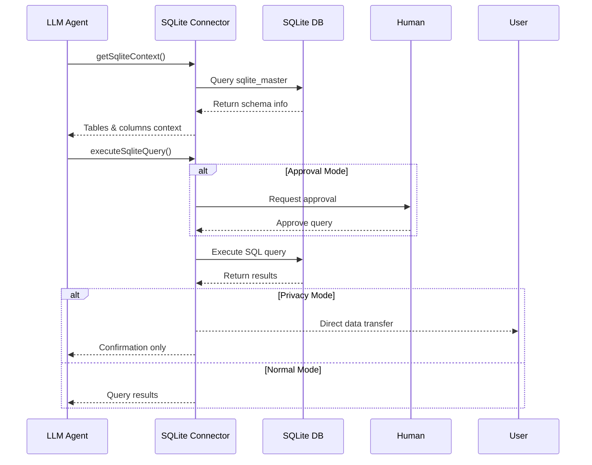

# SQLite Data Connector

The SQLite Data Connector enables LLMs to interact with SQLite databases through Inferable by providing schema understanding and query execution capabilities.

## Request Configuration

Configure the connector in your `config.json`:

```json
{
  "type": "sqlite",
  "name": "mySqlite",
  "filePath": "process.env.SQLITE_PATH"
}
```

## How It Works

The connector operates in two main phases:

1. **Schema Discovery**: When initialized, it analyzes the database structure and provides context to the LLM
2. **Query Execution**: Based on the schema understanding, it can execute SQL queries while respecting privacy and security settings



## Features

- **Schema Analysis**: Automatically maps database structure for LLM context
- **Privacy Mode**: Prevents sensitive data from passing through the LLM
- **Approval Mode**: Requires human approval for query execution
- **Sample Data**: Provides example rows to help LLM understand data patterns
- **File-Based**: Works with local SQLite database files

## Important Considerations

### Context Window Limitations

The connector may face challenges with large database schemas:

```typescript
// Example context structure
{
  tableName: "users",
  columns: ["id", "name", "email"],
  sampleData: ["1", "John Doe", "john@example.com"]
}
```

**Solution**: If you have many tables, create a separate database file with only the necessary tables:

```sql
ATTACH DATABASE 'llm_visible.db' AS llm;
-- Create tables with only necessary data
CREATE TABLE llm.users AS
SELECT * FROM main.users;
```

### Data Privacy

Large result sets passing through the LLM can:

- Consume excessive tokens
- Expose sensitive data
- Cause context overflow

**Solution**: Enable privacy mode to send data directly to the user:

```typescript
new SQLiteClient({
  filePath: "./database.sqlite",
  privacyMode: true,
});
```

### File Management

The connector automatically handles:

- File-based connection initialization
- Graceful shutdown on SIGTERM signals
- Single connection per database file
- Safe concurrent access to the database file

### SQLite-Specific Features

- **Serverless**: No need for a separate database server
- **Single File**: Entire database contained in one file
- **Portable**: Database can be easily moved or copied
- **Concurrent Access**: Built-in file locking mechanisms
